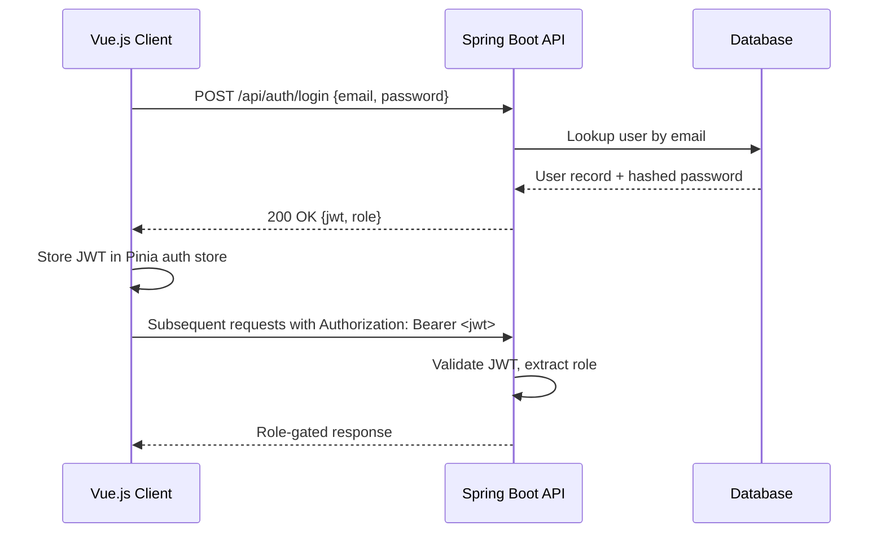

# Architecture

## Overview

Project Pulse is a full-stack web application built for TCU's Computer Science Senior Design program. It automates the submission and grading of Weekly Activity Reports (WARs) and peer evaluations.

**Stack:** Vue.js + Vuetify (frontend) · Spring Boot 3.3.5 (backend REST API) · MySQL or PostgreSQL (database) · Microsoft Azure (deployment)

---

## System Architecture Diagram


---

## Deployment Targets

| Component  | Azure Service                          |
|------------|----------------------------------------|
| Frontend   | Azure Static Web Apps                  |
| Backend    | Azure App Service                      |
| Database   | Azure Database for PostgreSQL or MySQL |
| Email      | Gmail SMTP via Spring Mail             |
| CI/CD      | GitHub Actions                         |

---

## Authentication Flow



---

## User Roles

| Role       | Primary Responsibilities                                              |
|------------|-----------------------------------------------------------------------|
| ADMIN      | Manages sections, teams, rubrics, active weeks, user invitations      |
| INSTRUCTOR | Supervises assigned teams, generates WAR and peer evaluation reports  |
| STUDENT    | Submits WAR activities and peer evaluations, views own report         |

---

## Key Business Rules (for agent reference)

- **BR-2:** Students may only submit peer evaluations during active weeks. WAR activities may be submitted outside active weeks.
- **BR-3:** Peer evaluations are locked after submission and cannot be edited.
- **BR-4:** A student may only submit a peer evaluation for the *previous* week. No makeups after the one-week window.
- **BR-5:** Students may never see private comments or the identity of their evaluators. Use `StudentEvalViewDto` on all student-facing endpoints — never expose the full `PeerEvaluation` entity.

---

## Architectural Style

### Backend

Domain-oriented modules — all classes for a domain live flat in a single package (no sub-package layers). Each module typically contains a controller, service, repository, entity, and any DTOs or enums it needs.

Benefits:

- Strong separation of concerns
- Clear ownership per domain
- Easier scaling
- Reduced merge conflicts in team development

### Frontend

Organized by role/domain for views (`admin/`, `instructor/`, `student/`) with shared API modules, components, stores, and utilities extracted into their own top-level folders.

---

## Backend Structure

Files within each module are flat (no sub-package folders) — all classes for a module live directly inside the module directory.

```
backend/
└── src/main/java/edu/tcu/projectpulse/
    ├── config/          # CorsConfig, JwtConfig, MailConfig, SecurityConfig
    ├── exception/       # GlobalExceptionHandler, ResourceNotFoundException, ValidationException
    ├── auth/            # AuthController, AuthService, JwtTokenProvider
    ├── activeweek/      # ActiveWeek, ActiveWeekController, ActiveWeekRepository, ActiveWeekService
    ├── invitation/      # InvitationController, InvitationService, InvitationToken, InvitationTokenRepository
    ├── peerevaluation/  # PeerEvaluation, PeerEvaluationController, PeerEvaluationRepository, PeerEvaluationService
    │                    # PeerEvalScore, PeerEvalScoreRepository
    ├── report/          # ReportController, GradeCalculator, PeerEvalReportService, WarReportService
    ├── rubric/          # Rubric, RubricController, RubricCriterion, RubricCriterionRepository
    │                    # RubricRepository, RubricService
    ├── section/         # Section, SectionController, SectionRepository, SectionRequest
    ├── team/            # Team, TeamController, TeamMember, TeamMemberRepository, TeamRepository, TeamService
    ├── user/            # User, UserController, UserRepository, UserRole, UserService
    └── war/             # WarActivity, WarActivityController, WarActivityRepository, WarActivityService
                         # ActivityCategory, ActivityStatus
```

---

## Layer Responsibilities

### controller

- Handles HTTP requests and responses
- Validates request structure
- Calls service layer
- Returns response

No business logic here.

---

### service

- Implements use cases
- Contains business logic
- Coordinates repositories and other services

---

### repository

- Handles database access
- Uses Spring Data JPA
- Contains query methods only

No business logic.

---

### domain

- Core domain models
- Entities
- Value objects
- Enums

May include domain-specific logic.

---

### dto

- Request and response objects
- Used for API communication

Should not be used as persistence entities.

---

## Shared Code

Cross-cutting infrastructure lives in dedicated top-level packages rather than a `shared/` folder:

- `exception/` — global exception handler, common exception types
- `config/` — security, CORS, JWT, mail configuration

Avoid creating a generic `shared/` or `util/` package; keep utilities close to the module that owns them.

---

## Dependency Rules

- Controller → Service
- Service → Repository + Domain
- Repository → Domain

Rules:

- No business logic in controllers
- No persistence logic in services
- Domain should not depend on controllers
- Minimize cross-module dependencies

---

## API Flow

```
Client → Controller → Service → Repository → Database
```

---

## Frontend Structure

```
frontend/
└── src/
    ├── api/             # Axios API modules: auth, war, peerEval, reports, rubric, sections, teams, users, activeWeeks
    ├── components/      # Shared UI components: AppNavBar, AppSidebar, ConfirmDialog, DataTable,
    │                    # PeerEvalForm, PeerEvalScoreTable, ReportTable, RubricCriteriaEditor,
    │                    # SearchBar, UserInviteForm, WarActivityForm, WarActivityTable
    ├── layouts/         # AuthLayout, DefaultLayout
    ├── plugins/         # axios.js (interceptors + base URL), vuetify.js
    ├── router/          # index.js (route definitions + auth guards)
    ├── stores/          # Pinia stores: auth, war, peerEval, reports, rubric, sections, teams
    ├── utils/           # dateUtils.js, gradeUtils.js
    └── views/
        ├── admin/       # AdminDashboard, SectionList/Detail/Create, TeamList/Detail/Create,
        │                # StudentList/Detail, InstructorList/Detail, InviteUsers,
        │                # RubricCreate, ActiveWeekSetup
        ├── instructor/  # InstructorDashboard, SectionReport, StudentWarReport,
        │                # StudentPeerReport, TeamWarReport
        └── student/     # StudentDashboard, WarView, WarReportView, PeerEvalSubmit,
                         # PeerEvalReportView, AccountSettings
```

---

## Key Principles

- Organize by domain first, then layer
- Keep business logic in services/domain
- Keep persistence isolated in repositories
- Avoid tight coupling between modules
- Prefer clear ownership per module

---

## Team Guidance

- Assign work by domain, not random use cases
- Each module should have a primary owner
- Cross-module changes require coordination
- Do not break module boundaries for convenience
