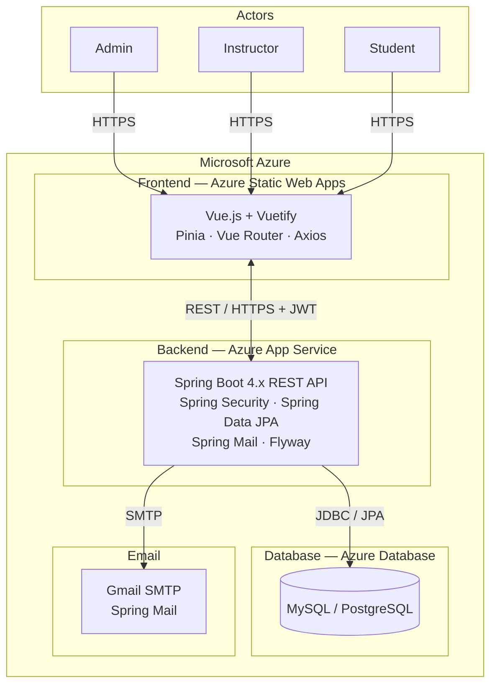
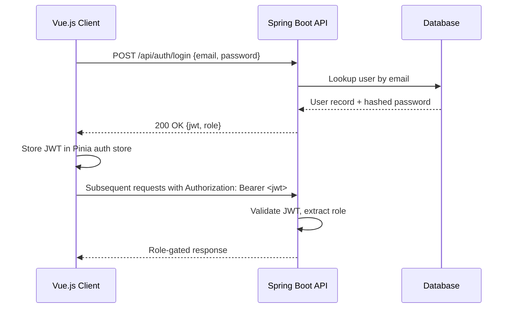

# Architecture

## Overview

Project Pulse is a full-stack web application built for TCU's Computer Science Senior Design program. It automates the submission and grading of Weekly Activity Reports (WARs) and peer evaluations.

**Stack:** Vue.js + Vuetify (frontend) · Spring Boot 4.x (backend REST API) · MySQL or PostgreSQL (database) · Microsoft Azure (deployment)

---

## System Architecture Diagram



---

## Deployment Targets

| Component  | Azure Service                          |
|------------|----------------------------------------|
| Frontend   | Azure Static Web Apps                  |
| Backend    | Azure App Service                      |
| Database   | Azure Database for PostgreSQL or MySQL |
| Email      | Gmail SMTP via Spring Mail             |
| CI/CD      | GitHub Actions                         |

---

## Authentication Flow



---

## User Roles

| Role       | Primary Responsibilities                                              |
|------------|-----------------------------------------------------------------------|
| ADMIN      | Manages sections, teams, rubrics, active weeks, user invitations      |
| INSTRUCTOR | Supervises assigned teams, generates WAR and peer evaluation reports  |
| STUDENT    | Submits WAR activities and peer evaluations, views own report         |

---

## Key Business Rules (for agent reference)

- **BR-2:** Students may only submit peer evaluations during active weeks. WAR activities may be submitted outside active weeks.
- **BR-3:** Peer evaluations are locked after submission and cannot be edited.
- **BR-4:** A student may only submit a peer evaluation for the *previous* week. No makeups after the one-week window.
- **BR-5:** Students may never see private comments or the identity of their evaluators. Use `StudentEvalViewDto` on all student-facing endpoints — never expose the full `PeerEvaluation` entity.

---

## Architectural Style

### Backend

Domain-oriented modules with internal layers. Each module contains:

- controller
- service
- repository
- domain
- dto

Benefits:

- Strong separation of concerns
- Clear ownership per domain
- Easier scaling
- Reduced merge conflicts in team development

### Frontend

Organized by feature/domain — feature-specific code grouped together, shared UI and utilities extracted into common folders.

---

## Backend Structure

```
backend/
└── src/main/java/com/tcu/projectpulse/
    ├── config/
    ├── shared/
    ├── auth/
    │   ├── controller/
    │   ├── service/
    │   ├── repository/
    │   ├── domain/
    │   └── dto/
    ├── user/
    │   ├── controller/
    │   ├── service/
    │   ├── repository/
    │   ├── domain/
    │   └── dto/
    ├── project/
    │   ├── controller/
    │   ├── service/
    │   ├── repository/
    │   ├── domain/
    │   └── dto/
    └── requirement/
        ├── controller/
        ├── service/
        ├── repository/
        ├── domain/
        └── dto/
```

---

## Layer Responsibilities

### controller

- Handles HTTP requests and responses
- Validates request structure
- Calls service layer
- Returns response

No business logic here.

---

### service

- Implements use cases
- Contains business logic
- Coordinates repositories and other services

---

### repository

- Handles database access
- Uses Spring Data JPA
- Contains query methods only

No business logic.

---

### domain

- Core domain models
- Entities
- Value objects
- Enums

May include domain-specific logic.

---

### dto

- Request and response objects
- Used for API communication

Should not be used as persistence entities.

---

## Shared Code

Use `shared/` only for:

- common exceptions
- utility classes
- response wrappers
- shared validation

Avoid moving code here too early.

---

## Dependency Rules

- Controller → Service
- Service → Repository + Domain
- Repository → Domain

Rules:

- No business logic in controllers
- No persistence logic in services
- Domain should not depend on controllers
- Minimize cross-module dependencies

---

## API Flow

```
Client → Controller → Service → Repository → Database
```

---

## Frontend Structure

```
frontend/
└── src/
    ├── router/
    ├── layouts/
    ├── shared/
    │   ├── components/
    │   ├── services/
    │   ├── utils/
    │   └── types/
    └── features/
        ├── auth/
        ├── projects/
        └── requirements/
```

---

## Key Principles

- Organize by domain first, then layer
- Keep business logic in services/domain
- Keep persistence isolated in repositories
- Avoid tight coupling between modules
- Prefer clear ownership per module

---

## Team Guidance

- Assign work by domain, not random use cases
- Each module should have a primary owner
- Cross-module changes require coordination
- Do not break module boundaries for convenience
