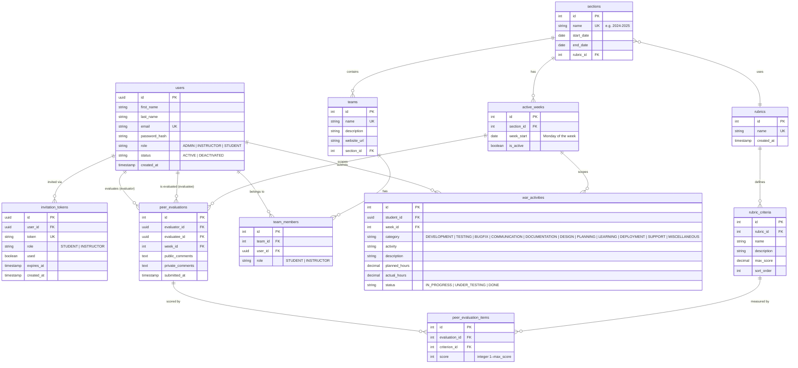

# Project Pulse — Database Schema

## Overview

All tables use surrogate integer or UUID primary keys. Foreign key relationships are enforced at the database level. Flyway manages migrations — files are append-only and must never be edited after creation.

---

## Entity Relationship Diagram



---

## Flyway Migration Order

| File | Owner | Contents |
|------|-------|----------|
| `V1__create_users.sql` | Shared | `users`, `invitation_tokens` |
| `V2__create_sections_rubrics_teams_weeks.sql` | P1 | `sections`, `rubrics`, `rubric_criteria`, `teams`, `active_weeks` |
| `V3__create_invitations_team_members.sql` | P2 | `invitation_tokens` indexes, `team_members` |
| `V4__create_war_activities.sql` | P2 | `war_activities` |
| `V5__create_peer_evaluations.sql` | P2 | `peer_evaluations`, `peer_evaluation_items` |
| `V6__create_instructor_assignments.sql` | P3 | Instructor-specific indexes and constraints |

> **Rule:** Never edit an existing migration file. Add a new versioned file for any schema change.

---

## Key Constraints (for agent reference)

- `users.email` — unique across all roles
- `sections.name` — unique (e.g. `2024-2025`)
- `teams.name` — unique within a section
- `rubrics.name` — unique; when a rubric is edited at section-creation time, the system duplicates it first (a new rubric is created, not mutated)
- `peer_evaluations` — unique on `(evaluator_id, evaluatee_id, week_id)`; one submission per evaluator per evaluatee per week
- `peer_evaluation_items` — unique on `(evaluation_id, criterion_id)`
- `team_members` — unique on `(team_id, user_id)`

---

## Grade Calculation Algorithm (UC-31)

Used in `GradeCalculator.java` and `PeerEvalReportService.java`:

```
For each student S in a week W:
  1. Collect all peer_evaluations where evaluatee_id = S and week_id = W
  2. For each evaluation E:
       total_score(E) = SUM of peer_evaluation_items.score for that evaluation
  3. grade(S, W) = AVG(total_score(E)) across all evaluations received

Example:
  Tim gives John:  10 + 9 + 10 + 9 + 10 + 10 = 58
  Lily gives John:  5 + 5 + 10 + 10 + 10 + 10 = 50
  John's grade = (58 + 50) / 2 = 54
```
